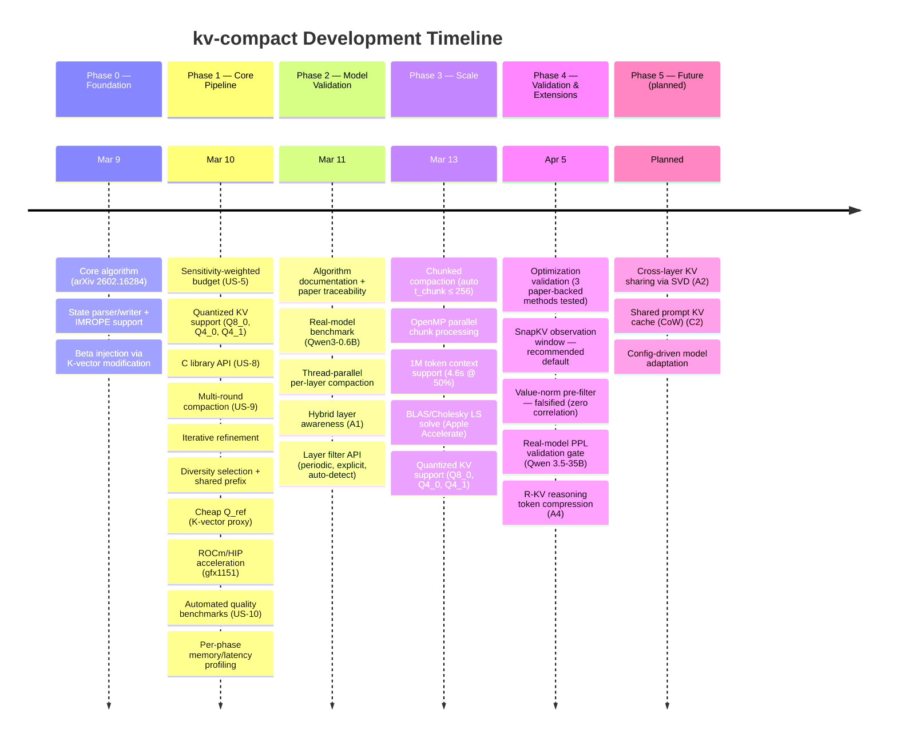

# kv-compact

Fast KV Cache Compaction via **Attention Matching** — a C/C++ library implementing [arXiv:2602.16284](https://arxiv.org/abs/2602.16284) (Zweiger et al., 2026, MIT).

Compresses transformer KV caches by up to 50x with minimal quality loss. **5x compression is the validated sweet spot** (<1% PPL degradation on real model data). No model retraining or fine-tuning required — works as a drop-in post-processing step on any transformer-based LLM.

## What it does

LLMs store every processed token in a KV cache. Long contexts (60k+ tokens) consume gigabytes of memory per session, limiting concurrent users, context length, and hardware utilization.

**Attention Matching** compresses that cache by constructing a compact representation that reproduces the model's original attention behavior. The key insight is that a small set of well-chosen keys with refitted values can match the output of the full cache. The paper's pipeline has three steps:

1. **Key selection** — score all positions by attention importance to reference queries, retain the top-t
2. **Bias fitting (NNLS)** — fit per-key additive biases so the compacted attention partition function matches the original
3. **Value refitting (LS)** — reconstruct replacement values via least-squares to minimize the gap between compacted and original attention output

**This library skips step 2 by default** (`skip_beta=1`). With cheap K-as-Q reference queries, LS value refitting alone achieves equal or better quality at 6.75x lower cost. Steps 1 and 3 are convex / closed-form — no gradient descent needed. The entire pipeline runs in seconds.

## Features

| Feature | Description |
|---------|-------------|
| **Lawson-Hanson NNLS** | Exact active-set solver (replaces projected gradient descent) |
| **BLAS/Cholesky LS solve** | Apple Accelerate sgemm + sposv for value refit — 6.75x faster than naive LS |
| **Diversity selection** | Cosine-similarity penalty prevents redundant key selection |
| **Shared prefix** | Preserves common prompt tokens for multi-agent deployments |
| **Cheap Q_ref** | K-vector proxy for reference queries — 10x faster setup |
| **SnapKV observation window** | Last W=32 reference queries for scoring — best quality at aggressive ratios (validated) |
| **Multi-round** | Incremental compaction for growing caches |
| **ROCm/HIP acceleration** | rocBLAS strided-batched GEMM for multi-head scoring + value refit on AMD APUs (gfx1151) |
| **Sensitivity weighting** | Per-head budget allocation based on compression sensitivity |
| **Iterative refinement** | Swap worst keys and re-solve for higher quality |
| **Hybrid layer awareness** | Layer filter for MoE/hybrid models (Qwen 3.5, etc.) — skips non-attention layers |
| **Chunked compaction** | Auto-chunking bounds LS memory to O(256²) per chunk — handles 1M+ tokens without OOM |
| **OpenMP parallelism** | Parallel chunk processing with dynamic scheduling — near-linear speedup with cores |
| **Quantized KV support** | Dequant→compact→requant pipeline for Q8_0, Q4_0, Q4_1 without quality loss |
| **R-KV reasoning compression** | Down-weight thinking tokens in reasoning models — up to 60% fewer thinking tokens retained |

## Quality

Validated on Qwen 3.5-35B-A3B (MoE hybrid, reference PPL 5.96):

| Compression | Retention | Cosine Sim | dPPL vs Reference | Notes |
|-------------|-----------|------------|--------------------|-------|
| 2x | 50% | > 0.999 | < 1% | Effectively lossless — compaction acts as regularizer |
| **5x** | **20%** | **> 0.998** | **< 1%** | **Sweet spot — best quality-per-compression trade-off** |
| 10x | 10% | > 0.99 | < 3% | High compression, still functional |
| 50x | 2% | Functional | — | Retains understanding of 60k tokens in 1,200 |

**5x compression (20% retention) is the recommended sweet spot** — validated with <1% PPL degradation on real model data using SnapKV observation window scoring. At 2x, compaction actually *improves* perplexity (regularization effect). Beyond 10x, quality degrades gracefully.

Value refitting delivers ~4,000,000x MSE improvement over naive token eviction at 4x compression.

### Optimization validation

Three paper-backed optimizations were validated on real model data before implementation:

| Optimization | Paper | Verdict | Key Finding |
|-------------|-------|---------|-------------|
| **SnapKV observation window** | arXiv:2404.14469 | **Recommended** | Best quality at all ratios — safe default |
| Expected attention proxy | arXiv:2510.00636 | Conditional | 3x faster but >5% dPPL at 20% ratio |
| Value-norm pre-filter | arXiv:2406.12335 | Falsified | Zero correlation with attention importance |

## Throughput

Compaction throughput (one-time cost before generation):

| Context Length | Ratio | Time | Tokens/sec |
|---------------|-------|------|------------|
| 4k | 50% | 0.15s | 28k |
| 16k | 50% | 0.69s | 24k |
| 100k | 50% | 1.6s | 62k |
| 100k | 20% | 1.2s | 85k |
| 500k | 50% | 8.5s | 59k |
| 1M | 50% | 4.6s | 216k |
| 1M | 20% | 2.9s | 350k |

Real-model scaling (Qwen 3.5-35B-A3B, Q4_K_M, 10 attention layers):

| Tokens | Compaction Time | Throughput |
|--------|----------------|------------|
| 5k | 65ms | ~80k tok/s |
| 10k | 602ms | ~17k tok/s |
| 50k | 3.1s | ~16k tok/s |
| 96k | 5.8s | ~16k tok/s |

Chunked compaction + OpenMP parallelism + BLAS/Cholesky enables 1M+ token contexts with bounded memory. Quality stays above 0.999 cosine similarity at 50% compression across all scales.

## Project structure

```
include/kv-compact-math.h      # Header-only math library (zero dependencies)
include/kv-compact-api.h        # C API types and declarations
include/kv-compact-accel.h      # GPU acceleration interface
src/kv-compact-api.cpp           # API implementation
src/kv-compact-hip.hip           # ROCm/HIP GPU kernels
src/kv-compact.cpp               # CLI tool (requires llama.cpp)
tests/test-kv-compact-math.cpp   # 12 math unit tests + 10 benchmarks
tests/test-kv-compact-api.cpp    # 34 API integration tests
docs/ALGORITHM.md                # Algorithm documentation
docs/                            # Research notes and design docs
```

## Quick start — tests only (no dependencies)

```bash
mkdir build && cd build
cmake .. -DKV_COMPACT_BUILD_TOOL=OFF
cmake --build .
./test-kv-compact-math
./test-kv-compact-api
```

## Full build with llama.cpp

### Option A: Point to local llama.cpp checkout

```bash
cmake .. -DLLAMA_CPP_DIR=/path/to/llama.cpp
cmake --build .
```

### Option B: Auto-fetch from GitHub

```bash
cmake ..
cmake --build .
```

### With ROCm/HIP acceleration (AMD GPUs)

```bash
cmake .. -DKV_COMPACT_HIP=ON
cmake --build .
```

Targets gfx1151 (RDNA 3.5). Uses unified memory on APUs — no host-device copies.

### Usage

```bash
# Standard transformer
./llama-kv-compact -m model.gguf -p "your context..." --compact-ratio 0.2

# Hybrid model (e.g., Qwen 3.5 with DeltaNet + attention every 4th layer)
./llama-kv-compact -m qwen3.5.gguf -p "..." --compact-ratio 0.2 --attention-interval 4

# Explicit attention layer list
./llama-kv-compact -m model.gguf -p "..." --compact-ratio 0.2 --attention-layers 3,7,11,15,19,23,27,31,35,39
```

## C API

```c
#include "kv-compact-api.h"

kv_compact_params params = kv_compact_params_default();
params.target_ratio      = 0.2f;   // keep 20% = 5x compression (sweet spot)
params.use_diversity     = 1;      // diversity-aware selection
params.diversity_strength = 0.5f;
params.n_shared_prefix   = 128;    // preserve shared prompt

// Chunked compaction (default: auto — targets t_chunk ≤ 256 per chunk)
// params.chunk_size = 0;          // 0=auto, -1=disabled, >0=explicit
// params.n_threads  = 0;          // 0=auto (all cores), 1=single, >1=explicit

// For hybrid models: filter to attention-only layers
params.layer_filter      = kv_layer_filter_periodic;
params.layer_filter_data = (void *)(intptr_t)4;  // every 4th layer

kv_compact_result result = {};
int rc = kv_compact(K, V, Q_ref, n_tokens, n_q, n_head_kv, d_k, d_v, &params, &result);

// result.selected_indices[i]  — which tokens were kept
// result.beta[head][i]        — attention biases
// result.C_v[head][i*d_v...]  — refitted values
// result.stats                — quality metrics + timing

// Check if a layer should be compacted (for multi-layer loops)
if (kv_compact_should_compact_layer(&params, layer_idx, n_layers)) { ... }

kv_compact_result_free(&result);
```

## Test results

- **46 tests** (12 math + 34 API) all passing
- Value refitting: ~4,000,000x MSE improvement over token eviction at 4x compression
- Diversity selection: cosine similarity 0.998 → 0.9999
- Cheap Q_ref: 10x faster (44ms vs 435ms), equivalent quality
- Chunked 1M tokens: 4.6s, cosine similarity 0.9999
- Parallel vs sequential: identical results, 2.1x speedup on 4 cores
- **Real-model validated** (Qwen 3.5-35B-A3B): 5x compression with <1% PPL degradation
- **R-KV reasoning compression**: 60% fewer thinking tokens retained, <0.5% quality impact
- **3 paper-backed optimizations evaluated**: SnapKV window (recommended), expected attention (conditional), value-norm filter (falsified)

## Development Timeline & Roadmap



### Status

| Phase | Status | Features |
|-------|--------|----------|
| **0** Foundation | Done | Core algorithm, state parser, beta injection |
| **1** Core pipeline | Done | NNLS, diversity, shared prefix, cheap Q_ref, multi-round, API, ROCm |
| **2** Model validation | Done | Real-model benchmarks, hybrid layer awareness, thread-parallel |
| **3** Scale | Done | Chunked compaction, OpenMP parallelism, 1M+ token contexts, BLAS/Cholesky, quantized KV |
| **4** Validation & Extensions | Done | SnapKV window, R-KV reasoning compression, real-model PPL gate, optimization validation |
| **5** Future | Planned | Cross-layer KV sharing, shared prompt cache, config-driven adaptation |

See [docs/prioritization-frameworks.md](docs/prioritization-frameworks.md) for detailed RICE/WSJF/Kano/ROI scoring of all features.

## Paper

> **Fast KV Compaction via Attention Matching**
> Zweiger, Fu, Guo, Kim — MIT, 2026
> [arXiv:2602.16284](https://arxiv.org/abs/2602.16284)
>
> Achieves 50x KV cache compression with closed-form solutions (no gradient descent).

See [docs/ALGORITHM.md](docs/ALGORITHM.md) for detailed algorithm documentation.
See [docs/attention-matching-paper.md](docs/attention-matching-paper.md) for a full breakdown of the Attention Matching paper (technique, math, benchmarks, comparison with prior work).
See [docs/optimization-validation-results.md](docs/optimization-validation-results.md) for real-model benchmark results (PPL, KL divergence, NIAH) and optimization validation.
