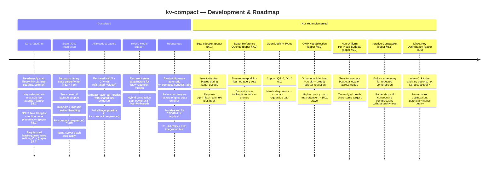

# kv-compact

Fast KV Cache Compaction via Attention Matching — a C++ implementation of [arXiv:2602.16284](https://arxiv.org/abs/2602.16284).

Compresses transformer KV caches by 50x with minimal quality loss using a closed-form 3-step algorithm:

1. **Key selection** — pick top-t keys by cumulative attention score
2. **NNLS bias fitting** — solve for attention mass biases (β) to match original attention distribution
3. **Least squares value refitting** — compute optimal compacted values (C_v) via ridge regression

## Project structure

```
include/kv-compact-math.h      # Header-only math library (zero dependencies)
include/kv-compact-state.h     # State parser/writer (F32, F16, transposed V)
include/kv-compact-api.h       # Public C API
src/kv-compact-api.cpp         # API implementation (full pipeline)
src/kv-compact.cpp             # CLI demo tool (requires llama.cpp)
tests/test-kv-compact-math.cpp # 31 unit tests
tests/test-kv-compact-e2e.cpp  # E2E integration test
docs/algorithms.md             # Detailed algorithm reference with paper §refs
```

## Quick start — tests only (no dependencies)

```bash
mkdir build && cd build
cmake .. -DKV_COMPACT_BUILD_TOOL=OFF
cmake --build .
./test-kv-compact-math
```

## Full build with llama.cpp

### Option A: Point to local llama.cpp checkout

```bash
cmake .. -DLLAMA_CPP_DIR=/path/to/llama.cpp
cmake --build .
```

### Option B: Auto-fetch from GitHub

```bash
cmake ..
cmake --build .
```

### Usage

```bash
./llama-kv-compact -m model.gguf -p "your context..." --compact-ratio 0.2
```

## Paper

> **Fast KV Compaction via Attention Matching**
> Zweiger et al., 2026 — [arXiv:2602.16284](https://arxiv.org/abs/2602.16284)
>
> Achieves 50x KV cache compression with closed-form solutions (no gradient descent).
> Value refitting reduces MSE by ~4,000,000x compared to naive token eviction.

## Test results

- 31 tests covering matrix ops, softmax, NNLS, least squares, and full pipeline
- Value refitting: ~4M× MSE improvement over token eviction at 4x compression
- Cosine similarity: 0.999999 at 50% compression

## Development timeline & roadmap



See [`docs/algorithms.md` §12](docs/algorithms.md#12-limitations--future-work) for detailed status of each item with code cross-references.
