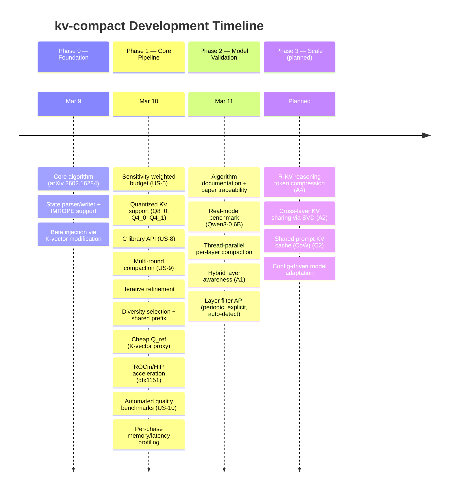

# kv-compact

Fast KV Cache Compaction via Attention Matching — a C/C++ library implementing [arXiv:2602.16284](https://arxiv.org/abs/2602.16284) (Zweiger et al., 2026, MIT).

Compresses transformer KV caches by up to 50x with minimal quality loss. No model retraining or fine-tuning required — works as a drop-in post-processing step on any transformer-based LLM.

## What it does

LLMs store every processed token in a KV cache. Long contexts (60k+ tokens) consume gigabytes of memory per session, limiting concurrent users, context length, and hardware utilization.

This library compresses that cache by constructing a compact representation that preserves the model's attention behavior:

1. **Key selection** — identifies which cached entries carry the most information across possible future queries
2. **Bias fitting (NNLS)** — calibrates per-key weights so the model correctly balances compressed history vs. new input
3. **Value refitting (LS)** — reconstructs replacement values that minimize the gap between compressed and original attention output

Each step is convex or closed-form. No gradient descent needed — the entire pipeline runs in seconds.

## Features

| Feature | Description |
|---------|-------------|
| **Lawson-Hanson NNLS** | Exact active-set solver (replaces projected gradient descent) |
| **Diversity selection** | Cosine-similarity penalty prevents redundant key selection |
| **Shared prefix** | Preserves common prompt tokens for multi-agent deployments |
| **Cheap Q_ref** | K-vector proxy for reference queries — 10x faster setup |
| **Multi-round** | Incremental compaction for growing caches |
| **ROCm/HIP acceleration** | Tiled matmul for AMD APUs (gfx1151 / RDNA 3.5) |
| **Sensitivity weighting** | Per-head budget allocation based on compression sensitivity |
| **Iterative refinement** | Swap worst keys and re-solve for higher quality |
| **Hybrid layer awareness** | Layer filter for MoE/hybrid models (Qwen 3.5, etc.) — skips non-attention layers |

## Quality

| Compression | Cosine Similarity | Notes |
|-------------|-------------------|-------|
| 2x | > 0.999 | Effectively lossless |
| 4x | > 0.99 | MSE ~4,000,000x better than token eviction |
| 50x | Functional | Retains understanding of 60k tokens in 1,200 |

## Project structure

```
include/kv-compact-math.h      # Header-only math library (zero dependencies)
include/kv-compact-api.h        # C API types and declarations
include/kv-compact-accel.h      # GPU acceleration interface
src/kv-compact-api.cpp           # API implementation
src/kv-compact-hip.hip           # ROCm/HIP GPU kernels
src/kv-compact.cpp               # CLI tool (requires llama.cpp)
tests/test-kv-compact-math.cpp   # 12 math unit tests + 10 benchmarks
tests/test-kv-compact-api.cpp    # 23 API integration tests
docs/ALGORITHM.md                # Algorithm documentation
docs/                            # Research notes and design docs
```

## Quick start — tests only (no dependencies)

```bash
mkdir build && cd build
cmake .. -DKV_COMPACT_BUILD_TOOL=OFF
cmake --build .
./test-kv-compact-math
./test-kv-compact-api
```

## Full build with llama.cpp

### Option A: Point to local llama.cpp checkout

```bash
cmake .. -DLLAMA_CPP_DIR=/path/to/llama.cpp
cmake --build .
```

### Option B: Auto-fetch from GitHub

```bash
cmake ..
cmake --build .
```

### With ROCm/HIP acceleration (AMD GPUs)

```bash
cmake .. -DKV_COMPACT_HIP=ON
cmake --build .
```

Targets gfx1151 (RDNA 3.5). Uses unified memory on APUs — no host-device copies.

### Usage

```bash
# Standard transformer
./llama-kv-compact -m model.gguf -p "your context..." --compact-ratio 0.2

# Hybrid model (e.g., Qwen 3.5 with DeltaNet + attention every 4th layer)
./llama-kv-compact -m qwen3.5.gguf -p "..." --compact-ratio 0.2 --attention-interval 4

# Explicit attention layer list
./llama-kv-compact -m model.gguf -p "..." --compact-ratio 0.2 --attention-layers 3,7,11,15,19,23,27,31,35,39
```

## C API

```c
#include "kv-compact-api.h"

kv_compact_params params = kv_compact_params_default();
params.target_ratio      = 0.5f;   // keep 50% of tokens
params.use_diversity     = 1;      // diversity-aware selection
params.diversity_strength = 0.5f;
params.n_shared_prefix   = 128;    // preserve shared prompt

// For hybrid models: filter to attention-only layers
params.layer_filter      = kv_layer_filter_periodic;
params.layer_filter_data = (void *)(intptr_t)4;  // every 4th layer

kv_compact_result result = {};
int rc = kv_compact(K, V, Q_ref, n_tokens, n_q, n_head_kv, d_k, d_v, &params, &result);

// result.selected_indices[i]  — which tokens were kept
// result.beta[head][i]        — attention biases
// result.C_v[head][i*d_v...]  — refitted values
// result.stats                — quality metrics + timing

// Check if a layer should be compacted (for multi-layer loops)
if (kv_compact_should_compact_layer(&params, layer_idx, n_layers)) { ... }

kv_compact_result_free(&result);
```

## Test results

- **35 tests** (12 math + 23 API) all passing
- Value refitting: ~4,000,000x MSE improvement over token eviction at 4x compression
- Diversity selection: cosine similarity 0.998 → 0.9999
- Cheap Q_ref: 10x faster (44ms vs 435ms), equivalent quality

## Development Timeline & Roadmap



### Status

| Phase | Status | Features |
|-------|--------|----------|
| **0** Foundation | Done | Core algorithm, state parser, beta injection |
| **1** Core pipeline | Done | NNLS, diversity, shared prefix, cheap Q_ref, multi-round, API, ROCm |
| **2** Model validation | Done | Real-model benchmarks, hybrid layer awareness, thread-parallel |
| **3** Scale | Planned | R-KV reasoning compression, cross-layer sharing, shared prompt cache |

See [docs/prioritization-frameworks.md](docs/prioritization-frameworks.md) for detailed RICE/WSJF/Kano/ROI scoring of all features.

## Paper

> **Fast KV Compaction via Attention Matching**
> Zweiger, Fu, Guo, Kim — MIT, 2026
> [arXiv:2602.16284](https://arxiv.org/abs/2602.16284)
>
> Achieves 50x KV cache compression with closed-form solutions (no gradient descent).

See [docs/ALGORITHM.md](docs/ALGORITHM.md) for detailed algorithm documentation.
