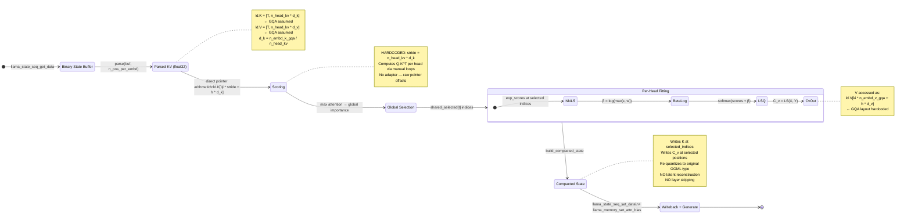
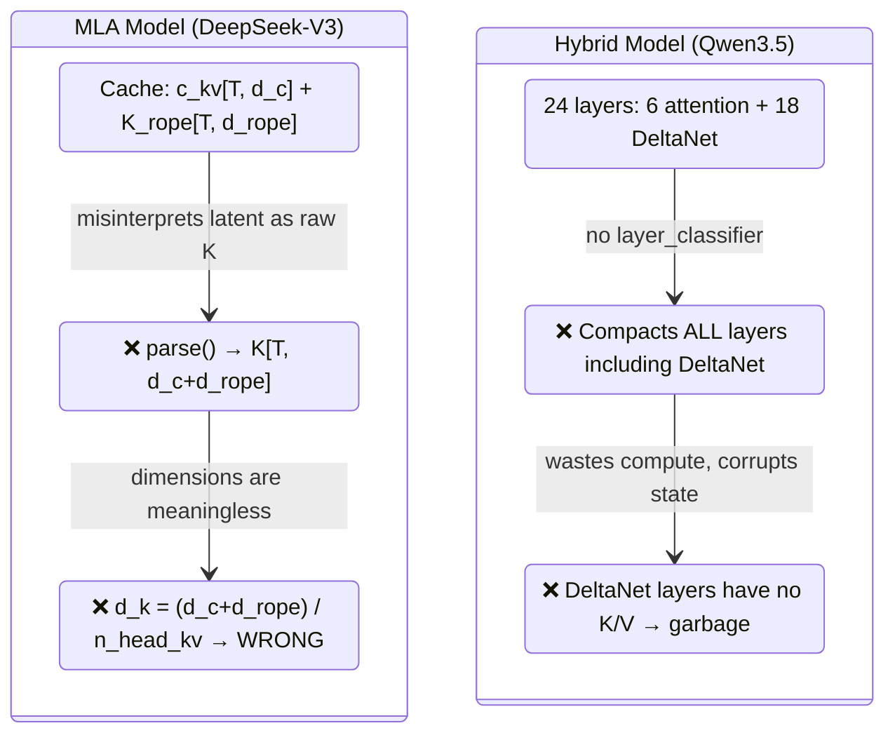
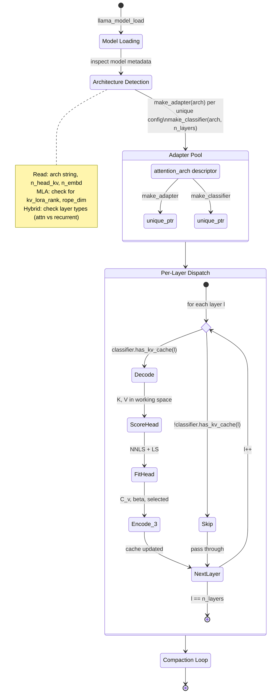

# KV Adapter State Machine — Current vs Desired

## Current Pipeline (GQA-only, hardcoded)

The CLI tool (`kv-compact.cpp`) directly accesses `ld.K` and `ld.V` from `parsed_kv_state`.
There is no adapter layer — the GQA interleaved layout is assumed everywhere.

### Problems with Current Design

## Desired Pipeline (Adapter-Mediated)

```mermaid
stateDiagram-v2
    direction LR

    [*] --> SaveState: llama_state_seq_get_data

    state "Binary State Buffer" as SaveState
    state "Parsed KV (float32)" as Parsed
    state "Adapter Resolution" as Resolve
    state "Scoring" as Score
    state "Global Selection" as Select
    state "Per-Head Fitting" as Fit
    state "Adapter Encode" as Encode
    state "Compacted State" as Compact
    state "Writeback + Generate" as Gen

    SaveState --> Parsed: parse(buf, n_pos_per_embd)
    Parsed --> Resolve: make_adapter(arch)\nmake_classifier(arch, n_layers)

    state Resolve {
        [*] --> Classify
        state if_layer <<choice>>
        Classify --> if_layer: classifier.has_kv_cache(l)?

        if_layer --> SkipLayer: false (DeltaNet/Mamba)
        if_layer --> SelectAdapter: true

        state if_arch <<choice>>
        SelectAdapter --> if_arch: arch.type?
        if_arch --> GQA: "gqa" / "mha" / "mqa"
        if_arch --> MLA: "mla"

        state GQA {
            state "decode = memcpy slice" as GQADec
            state "encode = memcpy slice" as GQAEnc
        }
        state MLA {
            state "decode = c_kv @ W_uk, c_kv @ W_uv" as MLADec
            state "encode = joint LS → latent" as MLAEnc
        }
        SkipLayer --> [*]: layer untouched
    }

    Resolve --> Score: adapter.decode(cache_k, cache_v, T, h, K, V)
    note right of Score
        Works on adapter-provided K[T,d_k], V[T,d_v]
        Same scoring math for all attention types
        d_k, d_v from adapter.geometry()
    end note

    Score --> Select: max attention → global importance\n(only over classified attention layers)
    Select --> Fit: shared_selected[t] indices

    state Fit {
        [*] --> NNLS_2: exp_scores at selected
        NNLS_2 --> Beta_2: β = log(max(ε, w))
        Beta_2 --> LSQ_2: softmax(scores + β)
        LSQ_2 --> Cv_2: C_v = LS(X, Y)
        note right of Cv_2
            Identical math to current pipeline
            Adapter is transparent here
        end note
    }

    Fit --> Encode: adapter.encode(K_comp, C_v, t, h, cache_k, cache_v)

    state Encode {
        state if_enc <<choice>>
        [*] --> if_enc
        if_enc --> GQAEncode: GQA
        if_enc --> MLAEncode: MLA

        state GQAEncode {
            state "memcpy head slice back" as GQACopy
        }
        state MLAEncode {
            state "Stack A=[W_uv; W_uk]" as Stack
            state "Stack B=[V; K_nope]" as StackB
            state "Joint LS: min||Ac-b||²" as JointLS
            state "c_kv = latent, K_rope preserved" as LatentOut
            Stack --> StackB
            StackB --> JointLS
            JointLS --> LatentOut
        }
    }

    Encode --> Compact: build_compacted_state
    Compact --> Gen: writeback + bias injection
    Gen --> [*]
```

## Adapter Lifecycle State Machine

## Data Flow Comparison

### GQA Path (current = desired, zero overhead)

```mermaid
stateDiagram-v2
    direction LR
    state "Cache K\n[T, n_kv·d_k]" as CK
    state "decode()\nmemcpy slice" as Dec
    state "K_head\n[T, d_k]" as KH
    state "Compact" as Comp
    state "C_v\n[t, d_v]" as CV
    state "encode()\nmemcpy slice" as Enc
    state "Cache K'\n[t, n_kv·d_k]" as CKOut

    CK --> Dec
    Dec --> KH
    KH --> Comp
    Comp --> CV
    CV --> Enc
    Enc --> CKOut
```

### MLA Path (new, with joint LS)

```mermaid
stateDiagram-v2
    direction LR
    state "Cache\nc_kv[T,d_c] || K_rope[T,d_r]" as CK
    state "decode()\nc_kv @ W_uk → K_nope\nc_kv @ W_uv → V\nconcat(K_nope, K_rope)" as Dec
    state "Working\nK[T, d_k_nope+d_r]\nV[T, d_v]" as Work
    state "Compact\n(identical math)" as Comp
    state "Compacted\nK'[t, d_k_nope+d_r]\nC_v[t, d_v]" as CompOut
    state "encode()\njoint LS:\nmin||[W_uv;W_uk]c - [V;K]||²\n→ c_kv'\npreserve K_rope" as Enc
    state "Cache'\nc_kv'[t,d_c] || K_rope[t,d_r]" as CKOut

    CK --> Dec
    Dec --> Work
    Work --> Comp
    Comp --> CompOut
    CompOut --> Enc
    Enc --> CKOut
```

## Transition Gap Analysis

| State Transition | Current | Desired | Gap |
|---|---|---|---|
| `SaveState → Parsed` | `parse()` with flat K/V | Same | None — parser is format-agnostic |
| `Parsed → Score` | Direct `ld.K[i*stride+h*d_k]` | `adapter.decode()` → working K,V | **CLI must call adapter.decode() instead of pointer arithmetic** |
| `Score → Select` | All layers participate | Only `classifier.has_kv_cache(l)` layers | **Add classifier gate in scoring loop** |
| `Select → Fit` | Same | Same | None — math is adapter-agnostic |
| `Fit → Compact` | `build_compacted_state` writes raw K/V | `adapter.encode()` → cache format | **State builder must accept adapter-encoded cache** |
| `Compact → Gen` | Works | Works | None — writeback is format-agnostic |

### Required CLI Changes (3 integration points)

1. **Line 322 loop**: wrap `ld.K` access with `adapter.decode(ld.K, ld.V, T, h, K_buf, V_buf)`
2. **Line 322 loop**: add `if (!classifier->has_kv_cache(l)) continue;`
3. **Line 520**: `build_compacted_state` needs adapter.encode() or accept C_v in cache format
