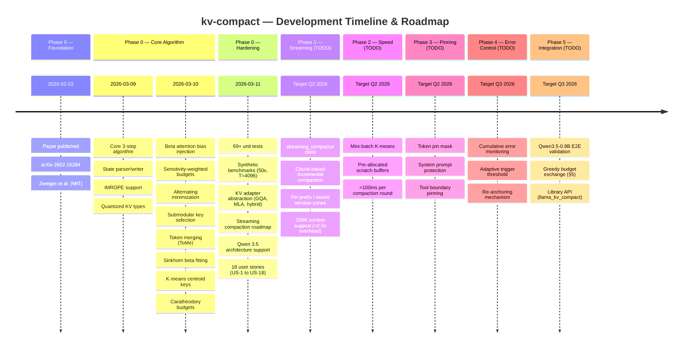
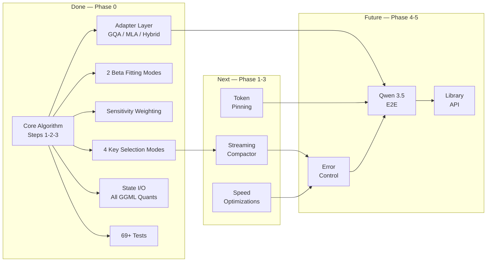
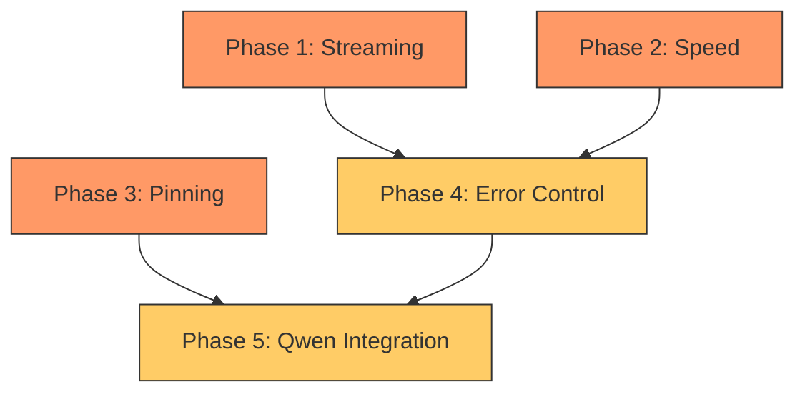

# Development Timeline & Roadmap

## Development History & Future Roadmap

```mermaid
timeline
    title kv-compact — Development Timeline & Roadmap

    section Phase 0 — Foundation
        2026-02-23 : Paper published
                   : arXiv 2602.16284
                   : Zweiger et al. (MIT)

    section Phase 0 — Core Algorithm
        2026-03-09 : Core 3-step algorithm
                   : State parser/writer
                   : IMROPE support
                   : Quantized KV types
        2026-03-10 : Beta attention bias injection
                   : Sensitivity-weighted budgets
                   : Alternating minimization
                   : Submodular key selection
                   : Token merging (ToMe)
                   : Sinkhorn beta fitting
                   : K-means centroid keys
                   : Carathéodory budgets

    section Phase 0 — Hardening
        2026-03-11 : 69+ unit tests
                   : Synthetic benchmarks (50x, T=4096)
                   : KV adapter abstraction (GQA, MLA, hybrid)
                   : Streaming compaction roadmap
                   : Qwen 3.5 architecture support
                   : 18 user stories (US-1 to US-18)

    section Phase 1 — Streaming (TODO)
        Target Q2 2026 : streaming_compactor class
                       : Chunk-based incremental compaction
                       : Pin prefix / recent window zones
                       : 200K context support (<2.5s overhead)

    section Phase 2 — Speed (TODO)
        Target Q2 2026 : Mini-batch K-means
                       : Pre-allocated scratch buffers
                       : <100ms per compaction round

    section Phase 3 — Pinning (TODO)
        Target Q2 2026 : Token pin mask
                       : System prompt protection
                       : Tool boundary pinning

    section Phase 4 — Error Control (TODO)
        Target Q3 2026 : Cumulative error monitoring
                       : Adaptive trigger threshold
                       : Re-anchoring mechanism

    section Phase 5 — Integration (TODO)
        Target Q3 2026 : Qwen3.5-0.8B E2E validation
                       : Greedy budget exchange (§5)
                       : Library API (llama_kv_compact)
```

## Feature Development Flow

```mermaid
graph LR
    subgraph "Done — Phase 0"
        A[Core Algorithm<br/>Steps 1-2-3] --> B[4 Key Selection Modes]
        A --> C[2 Beta Fitting Modes]
        A --> D[Sensitivity Weighting]
        A --> E[Adapter Layer<br/>GQA / MLA / Hybrid]
        A --> F[State I/O<br/>All GGML Quants]
        A --> G[69+ Tests]
    end

    subgraph "Next — Phase 1-3"
        H[Streaming<br/>Compactor]
        I[Token<br/>Pinning]
        J[Speed<br/>Optimizations]
    end

    subgraph "Future — Phase 4-5"
        K[Error<br/>Control]
        L[Qwen 3.5<br/>E2E]
        M[Library<br/>API]
    end

    B --> H
    E --> L
    H --> K
    I --> L
    J --> K
    K --> L
    L --> M
```

## Phase Dependencies

```mermaid
graph TD
    P1[Phase 1: Streaming] --> P4[Phase 4: Error Control]
    P2[Phase 2: Speed] --> P4
    P3[Phase 3: Pinning] --> P5[Phase 5: Qwen Integration]
    P4 --> P5

    style P1 fill:#f96,stroke:#333
    style P2 fill:#f96,stroke:#333
    style P3 fill:#f96,stroke:#333
    style P4 fill:#fc6,stroke:#333
    style P5 fill:#fc6,stroke:#333
```
